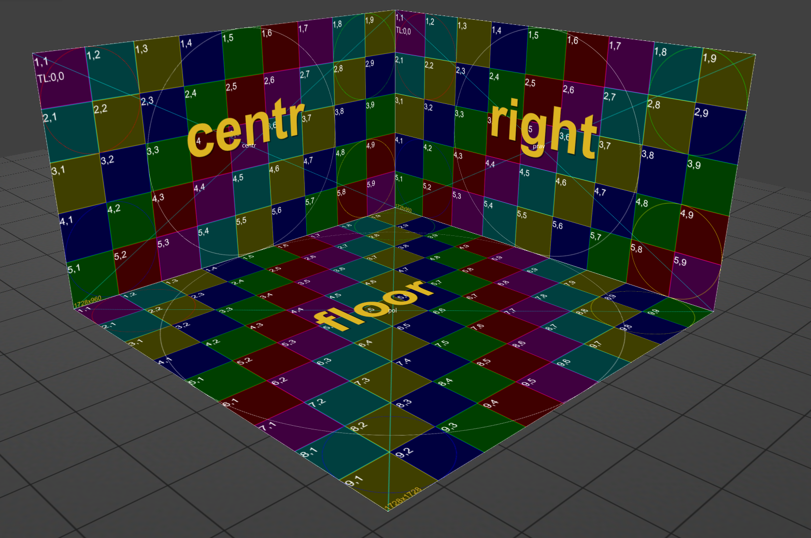

# Инструкция по языку MarkDown

Новая строка - это олна пустая строка

**Полужирный текст**

*Курсив текст*

## Цитирование
> Первый уровень
>> Второй уровень

## Списки
### Ненумерованные списки
* Лист 1
* Лист 2
### Нумерованные списки
1. Лист 1
2. Лист 2
3. Лист 3

## WEB ссылки
Текст [пример ссылки](http.example.com "Всплывающая подсказка")

## Работа с таблицами

Буква | Цифра | Символ
------ | ------|----------
a      | 4     | $
x      | 365    | (
b      |       | ^  

Буква|Цифра|Символ
---|---|---
a|4|$
 |365|(
b| |^  

Column | Column
------ | ------
\| Cell \|| \| Cell \|  


Column | Column | Column
:----- | :----: | -----:
Left   | Center | Right
align  | align  | align

## Картинки

### Это фотозона



### Это апельсин


# Работа с командами GIT

```sh


1. CD C:\Users\nick2\Documents\pr  "выбор папки в командной строке"
```
``` sh
2. git init - "создание репозитория git в папке"
```
``` sh 
3. git add  - "Добавление папки в к отслеживанию "
```
``` sh 
4. git commit -m "здесь текст комментария"    сохранение изменений в отслеживании
```
``` sh 
5. git log  "Посмотреть все сохранения "
```
``` sh 
git log --oneline "Посмотреть все сохранения КОРОТКО"
```
``` sh 
git log --oneline --graph  "Посмотреть наглядно ветки"
```
``` sh 
6. git checkout "Переход к другой сохраненной версии"
```
``` sh 
7. git checkout master "Переход к последней версии сохранений"
```
``` sh 
8. git diff - "разница, чем отличается файл после фиксации с новыми изменениями"
```
``` sh 
9. git branch - "создать новую ветку сохранений"  
```
``` sh 
10. git merge  vetka_01 скопировать веетку к мастеру
```
``` sh 
11. git branch -d "название ветки" - удалить ветку 
проверка сохранений
```
``` sh 
12. git log --graph красивое отображение веток сохранений
```
# РАБОТА С УДАЛЕННЫМИ РЕПОЗИТОРИЯМИ

## Первые шаги

1. Делаем fork репозитория, в которой потом хотим сделать pull request. Ищем кнопку Fork на странице репозитория <https://git@github.com:gulden-geekbrains/version_control.git>
2. Выполняем команду клонирования из своей fork-копии
```sh
git clone git@github.com:*YOURE_GITHUB*/version_control.git
```
3. Создаем новую ветку и вносим необходимые изменения в файл
```sh
git checkout -b updatereadme
vim README.md
git add README.md
git commit -m "Добавили инструкцию как создать pull request"
```
4. Делаем push  
```sh
git push --set-upstream origin updatereadme
```
5. Переходим на свою страницу репозитория. Выбираем ветку **updatereadme** и жмем кнопку **Compare & pull request**

## Заметки

Что бы сделать push от другого пользователя необходимо выполнить команду
```sh
GIT_SSH_COMMAND='ssh -i ~/.ssh/user-private-key -o IdentitiesOnly=yes' git push git@github.com:gulden-geekbrains/version_control.git
```

вместо *user-private-key* подставьте свой ключ

Можно прописать настройки для подсоединения по ssh
```sh
git config remote.origin.url git@github.com:gitusername/reponame
git config core.sshCommand "ssh -i ~/.ssh/user-private-key -o IdentitiesOnly=yes"
```
# Как подружить git с github под Windows 10

Вот видео инструкция https://youtu.be/E8cIjbJMEpE


# ТАКЖЕ

```sh
esc :wq "выйти из WIM редактора где w- write, а q - quit " 
```
```sh
cd .. "перейти в директорию на 1 уровень выше" 
```
```sh
mkdir new_file "mkdir- СОЗДАТЬ new_file- имя нового файла " тоесть можно создать файл сразу в терминале 
```

```sh
git push origin --delete название ветки              "удалить ветку из ГИТХАБА при помощи терминала" 
```

